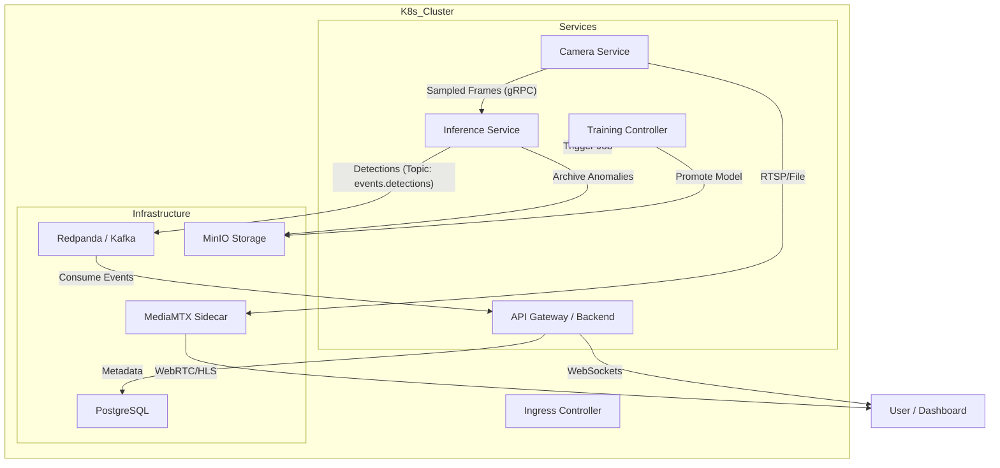

# Smart City Sentinel Architecture Document

## Introduction

This document outlines the overall project architecture for **Smart City Sentinel**, including backend systems, shared services, and MLOps infrastructure. Its primary goal is to serve as the guiding architectural blueprint for AI-driven development.

**Relationship to Frontend Architecture:**
This document defines the core contracts (API, WebSocket, Kafka schemas) that the Frontend will consume. It is designed to support the UX defined in `docs/front-end-spec.md`, specifically the "Mission Control" and "Triage Station" workflows.

### Change Log

| Date       | Version | Description                   | Author    |
| :---       | :---    | :---                          | :---      |
| 2026-01-10 | v1.2    | Added MLOps, Triage API, Schemas  | Architect |
| 2026-01-10 | v1.1    | Added explicit Container stack| Architect |
| 2026-01-10 | v1.0    | Initial MLOps Architecture    | Architect |

## High Level Architecture

### Technical Summary
The system follows a **Event-Driven Microservices** architecture running on **Kubernetes**. The core loop involves ingesting video streams, processing them through a Deep Learning model (YOLOv8), and broadcasting results in real-time. Key components include a **Camera Service** for stream handling, an **Inference Service** via KServe/Seldon, **Redpanda (Kafka)** for event streaming, and **Next.js** for the dashboard.

### High Level Overview
1.  **Architectural Style:** Microservices with Event-Driven Communication.
2.  **Repository Structure:** Monorepo (managing all services and IaC).
3.  **Video Strategy:** Decoupled Visualization and Inference. High-quality video flows to the user via **WebRTC/MSE** (low latency), while sampled frames flow to the Model via **gRPC/SharedMem**.
4.  **MLOps Strategy:** "GitOps" for code/config and "ModelOps" for model registry/promotion.

### High Level Project Diagram

> [!NOTE]
> This diagram illustrates the data flow from camera to user.




## Tech Stack

| Category | Technology | Version | Purpose | Rationale |
| :--- | :--- | :--- | :--- | :--- |
| **Language** | Python | 3.11 | Backend / ML | Ecosystem dominance in AI/ML; great FastAPI support. |
| **Language** | TypeScript | 5.3+ | Frontend | Type safety for complex UI state management. |
| **Frontend** | Next.js | 14 | Web Framework | Server-Side Rendering, API routes, React ecosystem. |
| **Backend** | FastAPI | 0.109+ | API Framework | High performance, native async support for WebSockets/Kafka. |
| **ML Runtime** | ONNX Runtime | Latest | Inference | Optimized CPU/GPU inference for YOLO models. |
| **Messaging** | Redpanda | Latest | Event Bus | Kafka-compatible, single binary (no Zookeeper), fast. |
| **Storage** | MinIO | Latest | Object Storage | S3 compatible, easy local K8s deployment. |
| **Database** | PostgreSQL | 16 | Metadata | Reliable relational storage for camera configs/events. |
| **Container** | Docker | 24+ | Container Runtime | Standard unit of deployment. |
| **Orchestration**| Kubernetes | 1.28+ | Cluster Manager | Scalable management of microservices (Minikube/K3s local). |
| **Infrastructure**| Terraform | 1.6+ | IaC | Industry standard for provisioning Minikube/K8s resources. |
| **Deployment** | ArgoCD | Latest | GitOps | Automated synchronization of K8s manifests. |

## Components

### 1. Camera Service (`camera-service`)
**Responsibility:** Connects to RTSP streams or local video files.
**Key Functions:**
1.  **Ingest:** Reads video source via OpenCV or FFmpeg.
2.  **Restream:** Pipes stream to `mediamtx` (local RTSP-to-WebRTC server) for frontend viewing.
3.  **Sample:** Extracts frames at defined interval (e.g., 5fps) for inference.
4.  **Forward:** Sends frames to Inference Service (gRPC).

### 2. Inference Service (`inference-service`)
**Responsibility:** Runs Object Detection on incoming frames.
**Key Functions:**
1.  **Predict:** Runs YOLOv8 (ONNX) on frames.
2.  **Filter:** Applies confidence thresholds and class filtering.
3.  **Publish:** Sends `DetectionEvent` to Kafka topic `events.detections`.
4.  **Archive:** If anomaly detected, uploads frame/clip to MinIO and includes URL in event.

### 3. API Service (`api-service`)
**Responsibility:** Aggregates data for the Frontend.
**Key Functions:**
1.  **Consumer:** Listens to `events.detections` from Kafka.
2.  **Broadcaster:** Pushes events to Frontend via WebSockets.
3.  **Persistence:** Stores event logs in PostgreSQL.
4.  **Management:** CRUD API for Camera configurations.

### 4. Frontend Application (`web-dashboard`)
**Responsibility:** Visualization.
**Key Functions:**
1.  **Video Player:** Uses MSE or WebRTC player to view `mediamtx` streams.
2.  **Overlays:** Canvas overlay drawing bounding boxes received via WebSockets.

### 5. Training Controller (`training-controller`)
**Responsibility:** Orchestrates the Active Learning Loop.
**Key Functions:**
1.  **Monitor:** Checks DB for >50 new human-verify annotations.
2.  **Trigger:** Launches K8s Job for retraining if threshold met.
3.  **Promote:** Updates model version in Git (GitOps) after successful training.

## MLOps & Active Learning Pipeline

This section defines the loop for continuous self-improvement of the model.

### Workflow
1.  **Trigger:** `training-controller` detects sufficient new labeled data in `annotations` table.
2.  **Training Job:** A Kubernetes Job (`kind: Job`) is spawned using `sentinel-training:latest`.
    *   Mounts PVCs for Dataset and Model Cache.
    *   Pull new annotations + matching images from MinIO.
    *   Fine-tunes User's YOLOv8 base model.
    *   Validates mAP against test set.
3.  **Model Registry:**
    *   If mAP improves, save ONNX model to MinIO: `s3://sentinel-models/v{n}/best.onnx`.
    *   Update `latest` alias.
4.  **Deployment (GitOps):**
    *   Controller commits change to `values.yaml` (e.g., `model_version: v6`).
    *   ArgoCD syncs, restarting `inference-service` with new model.

### Artifacts hierarchy (MinIO)
```text
s3://sentinel-models/
├── v1/
│   ├── best.pt
│   └── best.onnx
├── v2/
...
└── metrics/
    └── training-log.json
```

## Data Models & Schema

### Kafka Topic: `events.detections`
Structure of messages sent when objects are detected.

```json
{
  "topic": "events.detections",
  "key": "camera_id",
  "value": {
    "timestamp": "2026-01-10T12:00:01.000Z",
    "camera_id": "cam_01",
    "frame_id": "frame_123456",
    "detections": [
      {
        "class": "car",
        "confidence": 0.95,
        "bbox": [100, 200, 300, 400], // [x, y, w, h] normalized or px
        "track_id": 42
      }
    ],
    "anomaly_type": "congestion", // null if normal
    "image_url": "s3://sentinel-clips/cam_01/anomalies/123456.jpg" // Optional
  }
}
```

### Database Schema (PostgreSQL)

**Schema: public**

#### `cameras`
Configuration for video sources.
| Column | Type | Description |
| :--- | :--- | :--- |
| `id` | UUID | Primary Key |
| `name` | TEXT | Human readable identifier |
| `rtsp_url` | TEXT | Stream source URL |
| `latitude` | FLOAT | Geo-coordinate |
| `longitude` | FLOAT | Geo-coordinate |
| `status` | ENUM | 'online', 'offline', 'alert' |

#### `detections`
Raw events from the inference engine.
| Column | Type | Description |
| :--- | :--- | :--- |
| `id` | UUID | Primary Key |
| `timestamp` | TIMESTAMPTZ | When event happened |
| `camera_id` | ORCH | FK to Camera Config |
| `class_name` | TEXT | e.g. "car", "person" |
| `confidence` | FLOAT | 0.0 - 1.0 |
| `is_anomaly` | BOOLEAN | Flag for triage |
| `image_path` | TEXT | MinIO path to snapshot |

#### `annotations`
Human feedback for active learning.
| Column | Type | Description |
| :--- | :--- | :--- |
| `id` | UUID | Primary Key |
| `detection_id` | UUID | FK to `detections` (optional) |
| `image_path` | TEXT | MinIO path (if loose image) |
| `label` | TEXT | Corrected Class Name |
| `is_verified` | BOOLEAN | True if validated by human |
| `created_at` | TIMESTAMPTZ | timestamp |

#### `jobs`
Training Job History.
| Column | Type | Description |
| :--- | :--- | :--- |
| `job_id` | TEXT | K8s Job Name |
| `status` | ENUM | PENDING, RUNNING, SUCCEEDED, FAILED |
| `dataset_size` | INT | Number of images used |
| `result_map` | FLOAT | Resulting mAP score |
| `model_version` | TEXT | Output version tag (e.g. v5) |

## REST API Spec (Draft)

### Camera Management
*   `GET /api/cameras` - List all active cameras
    *   Response: `[{ "id": "...", "name": "Cam 1", "location": { "lat": 48.85, "lng": 2.35 }, "status": "online" }]`
*   `POST /api/cameras` - Add a new RTSP/File source
*   `DELETE /api/cameras/{id}` - Stop stream

### Event History
*   `GET /api/events?camera={id}&start={ts}&end={ts}` - Query historical anomalies

### Triage & Active Learning
*   `GET /api/triage/queue` - Get batch of 10 unverified anomalies (with images).
*   `POST /api/triage/{id}/validate`
    *   Body: `{ "correct_label": "bus", "verified": true }`
*   `POST /api/pipeline/trigger` - Force start a training run (Dev/Admin only).

## Infrastructure & Deployment

### Deployment Strategy: GitOps
We will use **ArgoCD** to sync the cluster state with the git repository.

**Pipeline Flow:**
1.  **Feature Branch:** Dev commits code.
2.  **PR Merged:** GitHub Actions triggers.
3.  **CI Build:**
    *   Build Docker images (`camera-service`, `api`, etc.).
    *   Push to Container Registry (e.g., GHCR or local registry).
4.  **GitOps Update:**
    *   CI script updates `k8s/v1/apps/values.yaml` with new image tags.
    *   Commits change to `main`.
5.  **Sync:** ArgoCD detects change in `main` and applies updates to K8s cluster.
6.  **Rollout:** K8s performs Rolling Update.

### Architecture Decision Records (ADR)
*   **ADR-001: WebRTC vs MJPEG.**
    *   *Decision:* **WebRTC (via MediaMTX)**.
    *   *Reason:* PRD requires "low latency". MJPEG uses excessive bandwidth for multiple streams. WebRTC is complex but necessary for a "Wow" factor and professional feel.
*   **ADR-002: Kafka vs HTTP for Inference.**
    *   *Decision:* **gRPC (Sync) for Frame->Inference**, **Kafka (Async) for Results**.
    *   *Reason:* Sending raw video frames over Kafka is anti-pattern (message size limits). gRPC is fast for point-to-point. Results (JSON) are perfect for Kafka to allow multiple consumers (Dashboard, Database, Archiver).
*   **ADR-003: Map Library Strategy.**
    *   *Decision:* **react-map-gl (Mapbox/LibreMap)**.
    *   *Reason:* Requires high-performance vector rendering for city-scale maps. `react-map-gl` offers excellent integration with React ecosystem and supports overlaying complex visualizations.

## Project Structure (Monorepo)

This project allows the **Standard BMad Monorepo** structure.

```text
smart-city-sentinel/
├── .bmad-core/             # Agent definitions and core workflows
├── .github/                # CI/CD Workflows (Actions)
├── docs/                   # Documentation (Architecture, PRD, Specs)
│   ├── architecture.md
│   └── prd.md
├── k8s/                    # Kubernetes Manifests (Helm/Kustomize)
│   ├── base/
│   └── overlays/
│       ├── dev/
│       └── prod/
├── services/               # Microservices Source Code
│   ├── api-gateway/        # FastAPI (Backend)
│   │   ├── app/
│   │   └── Dockerfile
│   ├── camera-service/     # OpenCV Ingest
│   │   └── Dockerfile
│   ├── inference-service/  # YOLOv8 Runner
│   │   └── Dockerfile
│   ├── training-controller/# Active Learning Logic
│   │   └── Dockerfile
│   └── web-dashboard/      # Next.js Frontend
│       ├── src/
│       └── Dockerfile
└── infra/                  # Terraform / IaC
    ├── main.tf
    └── variables.tf
```

## Next Steps / Directives

### For Developer Agent
*   Initialize the Monorepo structure.
*   Set up the standard `docker-compose` for local dev (simulating K8s services).
*   Begin **Epic 1**: Foundation (K8s + Redpanda + MinIO setup).

### For Frontend Agent / Architect
*   Review `docs/front-end-spec.md` (to be created).
*   Ensure the Video Player component supports WebRTC (WHIP/WHEP) or HLS fallback.
*   Design the State Management to handle high-frequency WebSocket events (throttle updates to 60fps).
