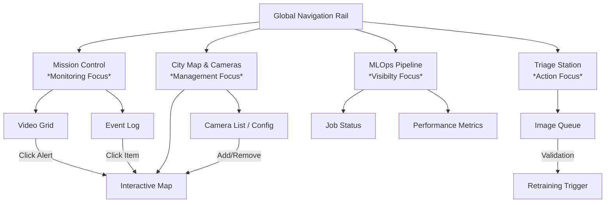
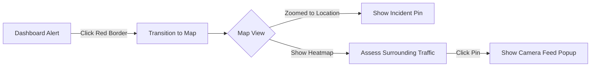
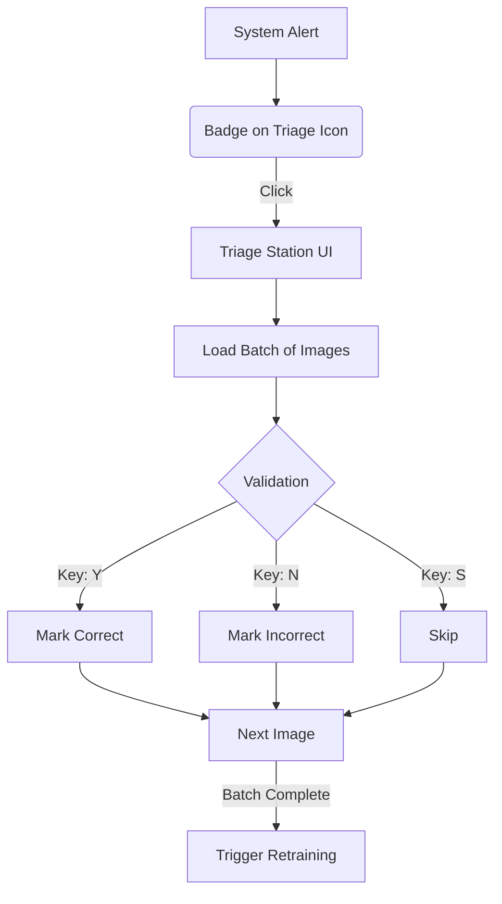

# Smart City Sentinel UI/UX Specification

## 1. Introduction

This document defines the user experience goals, information architecture, user flows, and visual design specifications for **Smart City Sentinel**'s user interface. It serves as the foundation for visual design and frontend development, ensuring a cohesive and user-centered experience.

### 1.1 Overall UX Goals & Principles

#### Target User Personas
*   **City Operator (Primary):**
    *   **Role:** Monitors live feeds, system status, and manages the surveillance network.
    *   **Needs:** Instant situational awareness, rapid access to camera details, and intuitive tools to **add/remove cameras** (via Map or List).
    *   **Context:** Works in a dimly lit control room environment.
*   **Triage Specialist:**
    *   **Role:** Reviews low-confidence detections marked by the AI.
    *   **Needs:** High-speed keyboard-driven interface, clear "Yes/No" validation flow, progress tracking.
*   **MLOps Engineer:**
    *   **Role:** Oversees the model retraining pipeline.
    *   **Needs:** Technical visibility into pipeline status (Training -> Deploying), error logs, and performance metrics.
*   **Presenter (Portfolio Viewer):**
    *   **Role:** The user (you) demonstrating the project to recruiters or stakeholders.
    *   **Needs:** "Demo Mode" to reset state easily, predictable "wow" moments, and a UI that explains itself without a manual.
    *   **Key Feature:** Needs a dedicated "Story Mode" or easy camera setup to show off capabilities quickly.

#### Key Usability Goals
1.  **Situational Awareness:** The operator must be able to assess the city's status (All Clear vs Incident) within **1 second** of looking at the dashboard.
2.  **Efficiency:** Triage actions should be performed with single keystrokes (< 2 seconds per image).
3.  **Clarity:** Critical alerts (Red) must be unmistakably distinct from warning (Amber) or safe (Green) states.
4.  **Demonstrability:** The system must be able to go from "Empty" to "Fully Running" in a short demo window (easy camera addition).

#### Core Design Principles
1.  **Cyberpunk Functionality:**
    *   Aesthetic inspired by sci-fi control centers (dark mode, neon accents).
    *   High contrast for readability in low-light environments.
    *   *Principle:* "Style serves function" - neon glow is for active states/alerts, not just decoration.
2.  **Information Density:**
    *   Maximize screen real estate. Avoid whitespace padding typical of consumer apps.
    *   *Principle:* "Every pixel earns its keep" - designed for 1080p+ dashboards.
3.  **Immediate Feedback:**
    *   System must feel "alive".
    *   *Principle:* "Show, don't just tell" - Micro-animations (pulsing recording dots, scrolling logs) confirm system health.

## 2. Information Architecture (IA)

### 2.1 Site Map / Screen Inventory

### 2.2 Navigation Structure

*   **Primary Navigation (Left Rail):**
    *   Persistent vertical sidebar.
    *   Items: *Mission Control*, *City Map*, *Triage*, *Pipeline*, *Settings*.
    *   **Notification Badge:** A red counter on the "Triage" icon alerts the user when new images need validation.
*   **Contextual Linking (The "Bridge"):**
    *   **Dashboard -> Map:** Clicking an alert opens the Map screen **focused and zoomed** on the incident location.
        *   *Rationale:* A modal window is too small for a city map. A full screen switch preserves the "Pro" feel, provided the transition is instant.

### 2.3 Management Strategy
*   **"Edit on Map":** Camera addition/removal is located on the **Map & Cameras** screen.
*   **Traffic Heatmap:** The Map features a "Heatmap Layer" visualization.
    *   *Green Glow:* Normal flow.
    *   *Red Pulse:* Congestion/Anomaly.
    *   *Consistency:* This matches the border colors of the camera feeds on the Dashboard.

## 3. User Flows

### Flow 1: Incident Response (The "Bridge")
**User Goal:** Identify an anomaly on video and understand its location in the city.

### Flow 2: Active Learning Loop (Triage)
**User Goal:** Clear the backlog of low-confidence detections.

## 4. Key Screen Layouts

### 4.1 Mission Control (Dashboard)
**Purpose:** High-density monitoring of the entire city state.

*   **Left Rail (5%):** Navigation Icons + Notifications.
*   **Center Grid (75%):** Responsive Video Grid (2x2 to 6x6).
    *   *State Normal:* Clean video feed, minimal overlays (Location Name).
    *   *State Hover:* Show "Expand" button.
    *   *State Alert:* Red pulsing border.
*   **Right Panel (20%):** Live Event Log.
    *   Scrolling list of detection events ("Car stopped at Main St").
*   **Modal Overlay (Expanded View):**
    *   Triggered by "Expand" on any grid item.
    *   Features: Audio unmuted, Full YOLO labels visible, Confidence scores shown.

### 4.2 Triage Station
**Purpose:** Rapid human supervision of AI uncertainty.

*   **Central Focus:** Large, high-res crop of the detected object.
*   **Interaction Zone (Bottom):**
    *   **LEFT (Left Arrow/Swipe):** Reject / False Positive.
    *   **RIGHT (Right Arrow/Swipe):** Confirm / True Positive.
    *   **UP (Up Arrow):** **Edit Box** mode (Enables drag handles to resize bounding box).
    *   **DOWN (Down Arrow):** Skip.

## 5. Component Library

### 5.1 Core Components
*   `StreamCard`
    *   **Props:** `streamUrl`, `status` (Live/Offline/Alert), `labelMode` (Hidden/Visible).
    *   **Behavior:** Lazy loads HLS stream. On hover, shows actions.
*   `LogStream`
    *   **Props:** `events[]`.
    *   **Behavior:** Auto-scrolls to bottom. Pauses scroll on hover.
*   `TriageCard`
    *   **Props:** `imageUrl`, `predictedClass`, `confidence`.
    *   **Behavior:** Handles keyboard events for rapid-fire sorting.
*   `MapGl`
    *   **Props:** `markers[]`, `heatmapData`.
    *   **Behavior:** WebGL powered map (Mapbox/Leaflet). Handles "FlyTo" animations from Dashboard bridge.

## 6. Branding & Style Guide

### 6.1 Visual Identity "Cyberpunk Modern"
Combining the raw data aesthetic of a terminal with the polish of modern SaaS.

### 6.2 Color Palette
| Color Type | Hex Code | Usage |
| :--- | :--- | :--- |
| **Background** | `#050510` | Deepest distinct Navy/Black. Main background. |
| **Surface** | `#1A1A2E` | Card backgrounds, panels. |
| **Primary (Neon)** | `#00F0FF` | Active elements, selection borders, "Cyber" accents. |
| **Success** | `#00FF94` | Healthy servers, fluent traffic, "True Positive". |
| **Alert (Danger)** | `#FF2A6D` | Critical Anomalies, "True Negative", Error states. |
| **Warning** | `#FFC857` | High latency, potential issues. |
| **Text Primary** | `#EAEAEA` | Main content. |
| **Text Muted** | `#8892B0` | Metadata, timestamps, less important labels. |

### 6.3 Typography
*   **Font Family:** `Inter` (Google Fonts).
    *   *Rationale:* Selected for maximum legibility at small sizes (dense data) and a clean, "scientific" look (Option B).
*   **Weights:**
    *   **Bold (700):** KPI Numbers, Alert Headers.
    *   **Medium (500):** Button labels, Navigation.
    *   **Regular (400):** Logs, Body text.

## 7. Performance Requirements
*   **Video Latency:** Glass-to-glass latency must remain under **2 seconds** for "Live" feel.
*   **Interaction Response:** Hover states (e.g., expanding a camera) must render within **100ms**.
*   **Map Transition:** The "FlyTo" animation from Dashboard to Map must be smooth (60fps) and take no longer than **1.5 seconds**.

## 8. Accessibility (A11y)
*   **Keyboard First (Triage):** The Triage Station must be fully operable without a mouse.
    *   `ArrowLeft` / `ArrowRight`: Decide.
    *   `ArrowUp`: Enter Edit Mode.
    *   `Space`: Play/Pause video (if applicable).
*   **Contrast:** All text must meet WCAG AA standards against the dark background.
*   **Focus Indicators:** Critical in a dark interface. Focus states must use the Primary Neon color (`#00F0FF`) with a clear glow shadow.

## 9. Next Steps
1.  **Approval:** Product Manager & User to sign off on this spec.
2.  **Prompt Generation:** UX Expert to run `*generate-ui-prompt` to create the v0/Lovable prompts.
3.  **Handoff:** Architect to use Component definitions for the React/Next.js structure.

